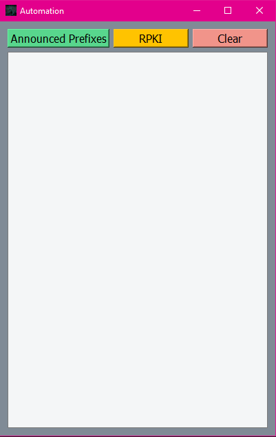

RIPE-API-GUI
##python

Libraries:

- requests

- datetime

- sys

- PyQt5

API-Website : https://stat.ripe.net/docs/data_api#announced-prefixes

API-Website : https://stat.ripe.net/docs/data_api#rpki-validation

1. Install Libraries.
2. Execute GUI-PyQt.py file (it is main file).

